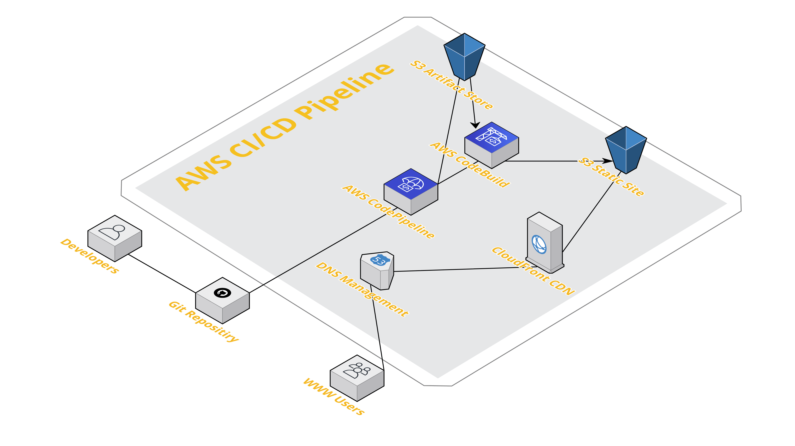

# AWS CodePipline / CodeBuild Implementation
The code in this repositiory should allow you to seamlessly integrate a simple AWS CodePipline workflow with an AWS CodeBuild project. 

The goals of this project are as follows:
- Deploy the neccessary infrastrcutre to create an AWS CI/CD pipeline
- Deploy the infrastructure leveraging industry standard IaC (Terraform)
- Have the infrascture configured leveraging best practices (Both AWS and Terraform)
- Facilate an automatic AWS CodeBuild project when a commit is detected into a designated branch

## Architecture Diagram

The architecture is a large high quality file. Click <a href = "https://raw.githubusercontent.com/TheMedina/blog.masterthe.cloud-terraform/main/pipeline.png" target = "_blank">here</a> to view it closer to native resolution and ease of use.

## Deployed Resources

OUT OF DATE. UPDATE COMING SOON

This Terraform project will deploy the following resources:
- An AWS CodeBuild Project x1
- An AWS CodePipeline with two stages (Source and Build) x1
- S3 Buckets (Static and Artifacts) x2
- IAM Roles (One for AWS CodeBuild and one for CodePipeline) x2
- IAM Policies (One for AWS CodeBuild and one for CodePipeline) x2
- S3 Bucket Policies (One for each S3 bucket) x2

## Terraform Modules

COMING SOON

## Notes
This repository does not include the buildspec.yml required for AWS CodeBuild. Additionally, both the AWS CodePipeline Source and AWS CodeBuild project point to the same repository. For this project I chose to have my source files and buildspec.yml in the same repository. Feel free to change this in the provided modules. 

## Todo List
- Lock down S3 Artifact Store bucket polcies
- Add a CloudFront Distribution
- Make buckets private and only allow signed URLs via CloudFront